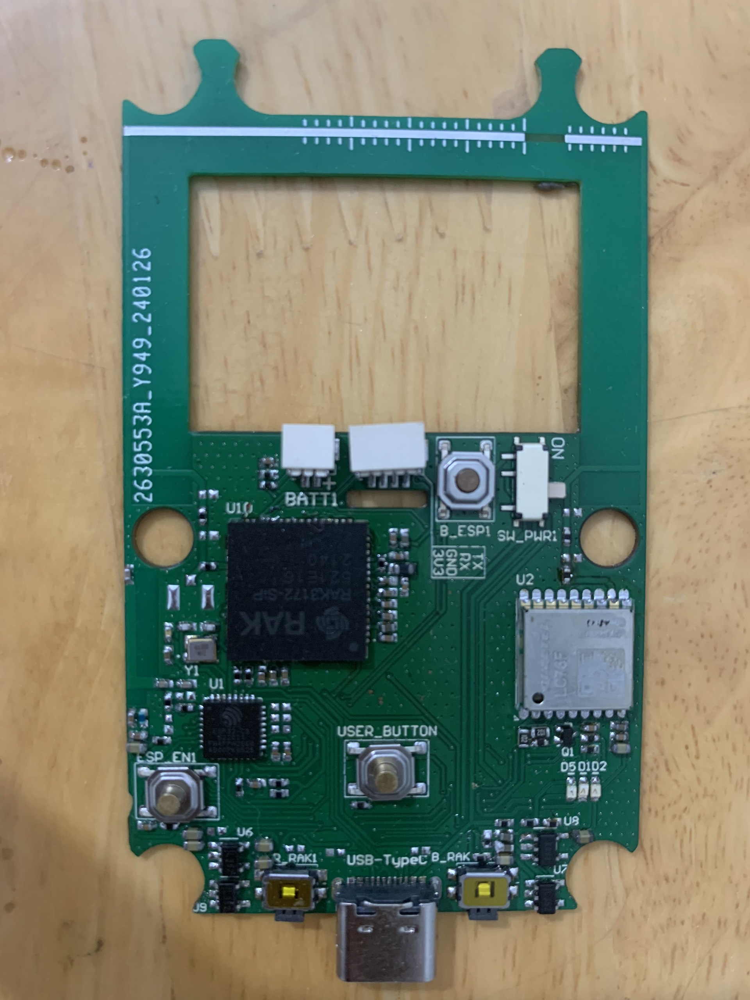
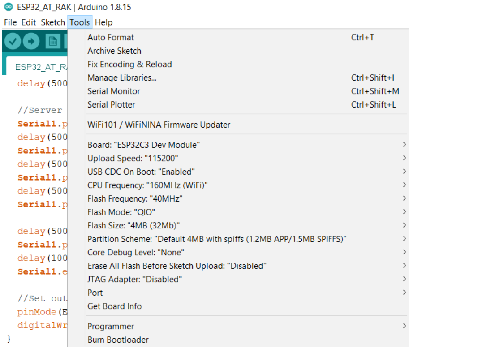
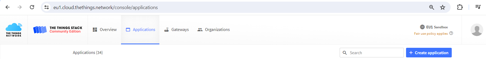
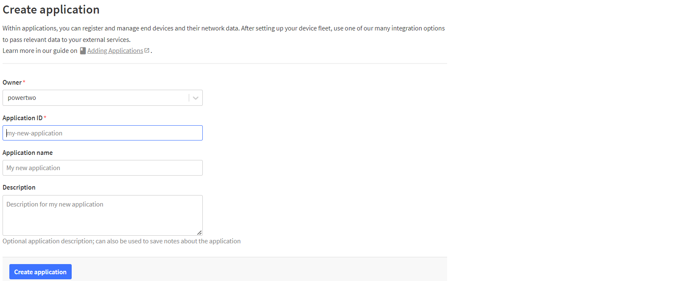
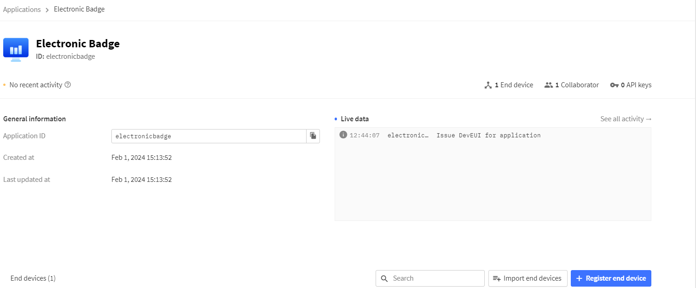
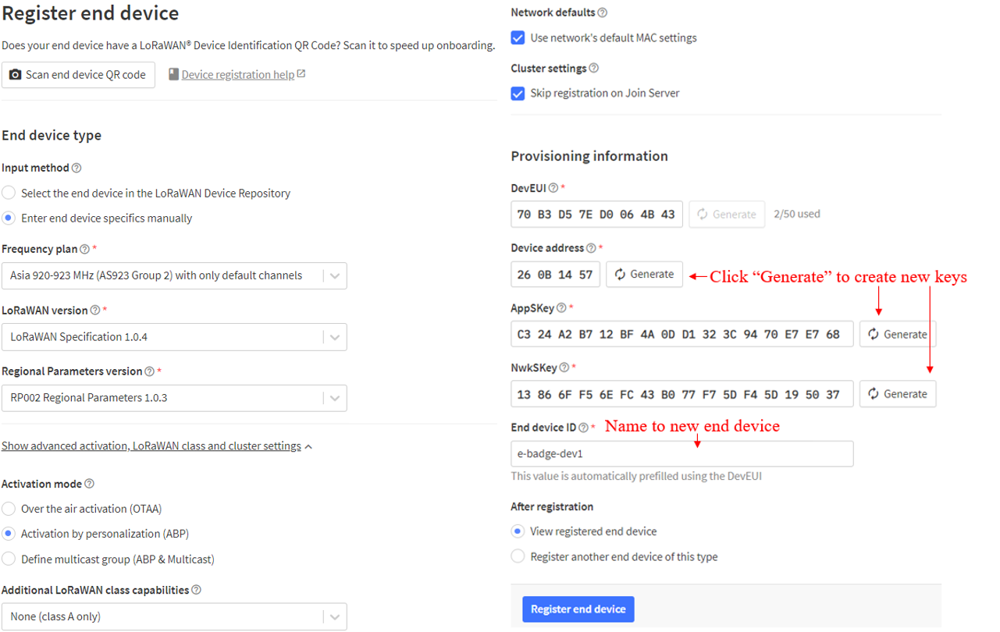
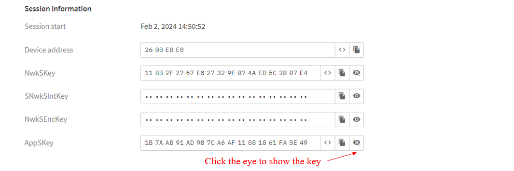
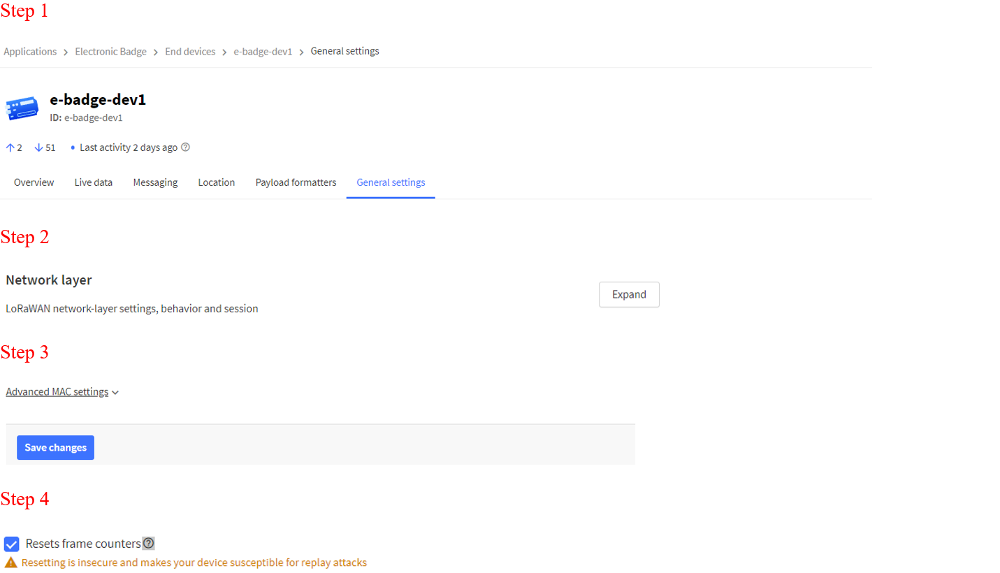

# LoRaWAN communication demo for RFThings Electronic Badge
An Arduino sketch example shows how to communicate with a LoRaWAN gateway. When the user presses the USER Button, the device will send a LoRaWAN packet which contains the location to the network server. 

**Board overview**

**Connection of ESP32 with RAK3172 SiP (LoRaWAN SiP) and LC76F Module (GNSS Module)**

# Board Manager
The example used [espressif/arduino-esp32](https://docs.espressif.com/projects/arduino-esp32/en/latest/getting_started.html). Refer to this [Getting Started](https://docs.espressif.com/projects/arduino-esp32/en/latest/getting_started.html) for installation guide of this core.

To compile the example, select board manager as followings in ArduinoIDE

# Libraries

The sketch required following libraries. Make sure you have them installed:

| Header Included |           Library Reposistory            |
| :-------------: | :--------------------------------------: |
|   MicroNMEA.h   | https://github.com/stevemarple/MicroNMEA |

# The Things Network (TTNv3)

The Things Network is a LoRaWAN Network Server which is the critical component for any LoRaWAN solution. Refer to how to register the gateway at https://www.thethingsindustries.com/docs/gateways/ and the device at https://www.thethingsindustries.com/docs/devices/

ABP (Activation By Personalization) activation mode is used. For more details about ABP mode, refer to https://www.thethingsnetwork.org/docs/lorawan/end-device-activation/

To create and retrieve access information to the LoRaWAN network for a new device, access to https://eu1.cloud.thethings.network/console/applications. Click "Create application"

Access the newly created application to create a new end device, click "Register end device"

On the Register end device console, choose parameters to set up for new device

Access the newly created end device to get the keys for LoRaWAN network

To General settings => Expand for Network Layer => Advanced MAC settings => Tick “Resets frame counter” checkbox

# Configuration commands

LoRaWAN credentials are defined in commands below. These values need to be updated with your own application / network server. Users need to change this information when creating a new LoRaWAN device.

| AT Command | Abbreviation |       Description       |
| :--------: | :----------: | :---------------------: |
| AT+DEVADDR |   DevAddr    |     Device address      |
| AT+APPSKEY |   AppSKey    | Application Session Key |
| AT+NWKSKEY |   NwkSKey    |   Network Session Key   |

For other configurations, refer to https://docs.rakwireless.com/RUI3/Serial-Operating-Modes/AT-Command-Manual

